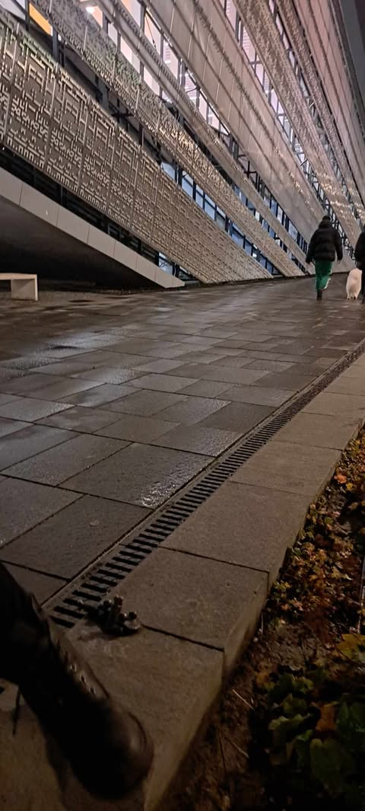
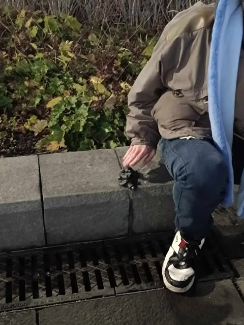
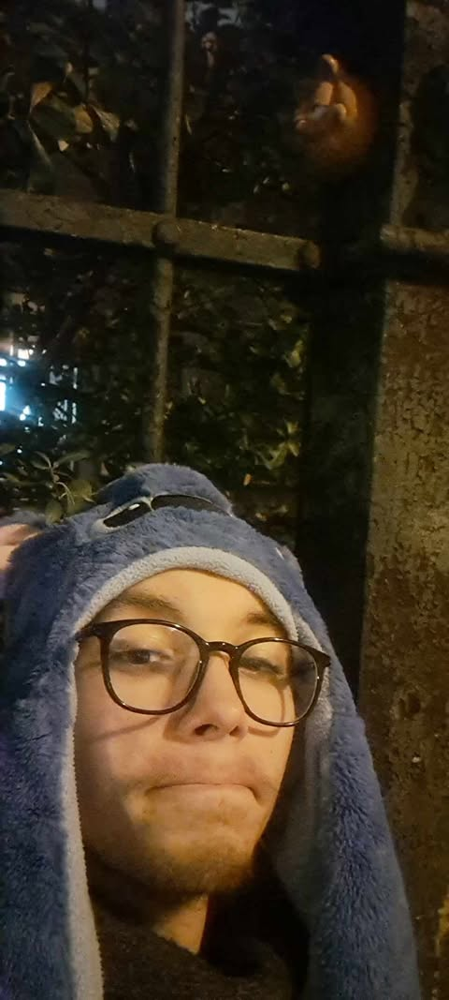
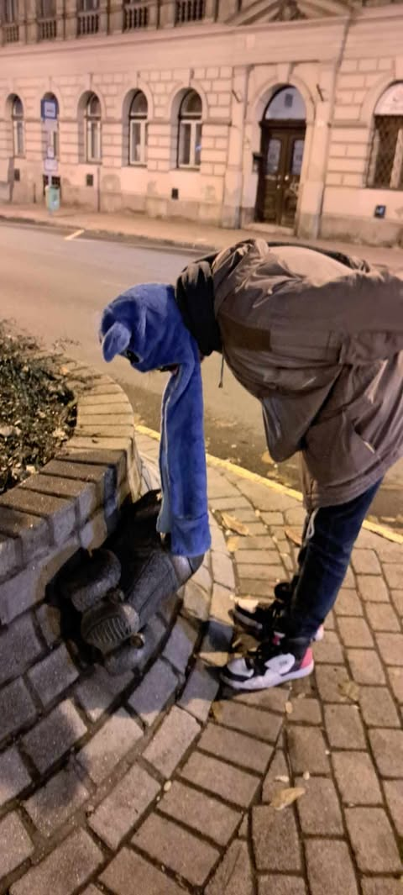
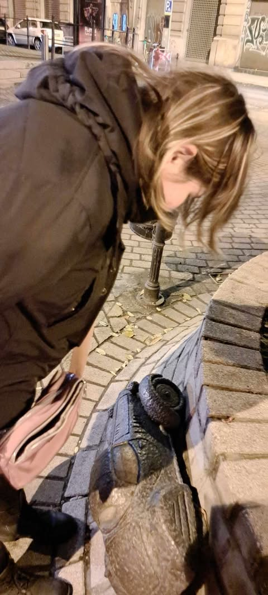
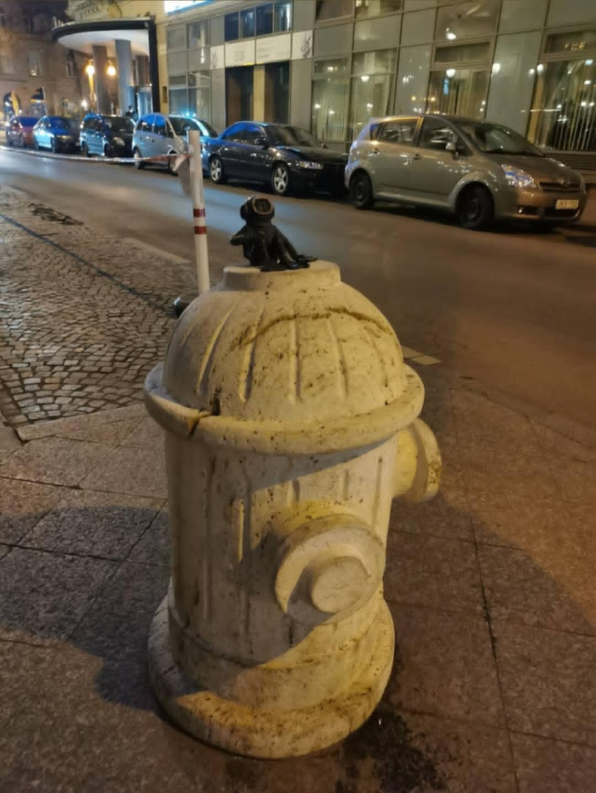

# Sztálin Csizmája
2

3
Ez a szobor a budapesti **1956-os forradalom** egyik **emblematikus eseményére utal**, amikor a nép ledöntötte **Sztálin** szobrát, amelynek csak a **csizmái maradtak** a helyén. Kolodko miniatűr szobra ezt a jelenetet idézi meg: **két apró csizma** áll magányosan, **groteszk** módon szimbolizálva a hatalmi rendszerek **mulandóságát** és az **elnyomás** elleni lázadást.
4

5
​
6
# Garfield
7

8
A kultikus **amerikai képregényhős**, ***Garfield***, Kolodko keze alatt új **kontextusba** kerül. Ez a macska, aki **lusta**, **önző**, mégis **szerethető,** a modern fogyasztói társadalom humoros **kritikáját** nyújthatja. A miniszobor szinte "**élővé**" teszi a karaktert, aki megbújik egy **váratlan** helyen, hogy **mosolyt** csaljon az arra járók arcára.
9
​
10
# Tizenégy karátos autó
11

12
**Rejtő Jenő** híres regényét idézi ez az alkotás, amely a **magyar irodalom** egyik **klasszikusa**. Az apró szobor egy miniatűr **luxusautót** formáz, finoman utalva a történet **szatirikus humorára** és a kisember nagy **kalandjaira**. A mű nemcsak a **könyv rajongóinak** okoz örömet, hanem a **magyar kultúra** iránt érdeklődők számára is különleges élmény.
13

14
​
15
# A Búvár és a kulcs
16

17
Kolodko egyik **legkedvesebb alkotása**, amely egy **apró búvárt** ábrázol, aki a **víz mélyére merül** egy **kulcs** után. Ez a szobor egyszerre **játékos** és **gondolatébresztő**: a búvár **szorgalma** és **kitartása** az **emberi kíváncsiságot** és **elszántságot** szimbolizálhatja, miközben a ***kulcs*** a **hétköznapiságot** jeleníti meg.
