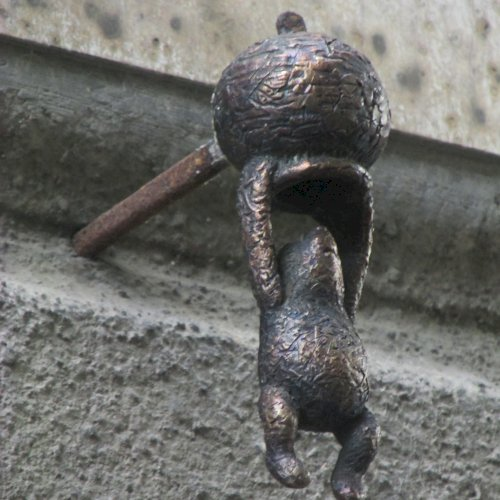
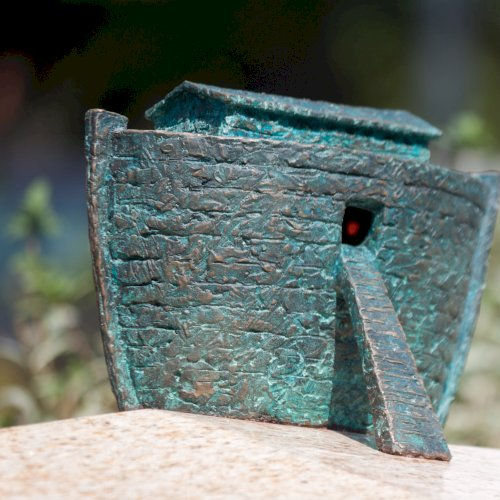
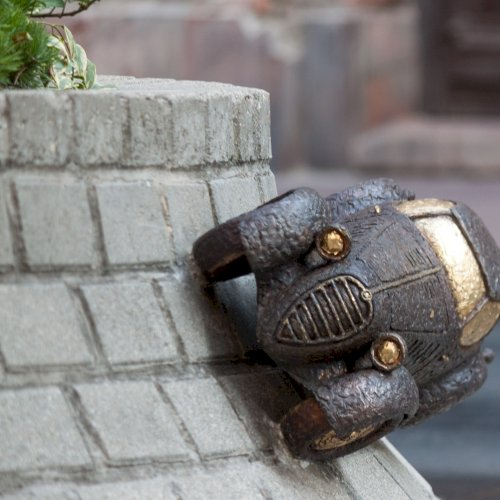
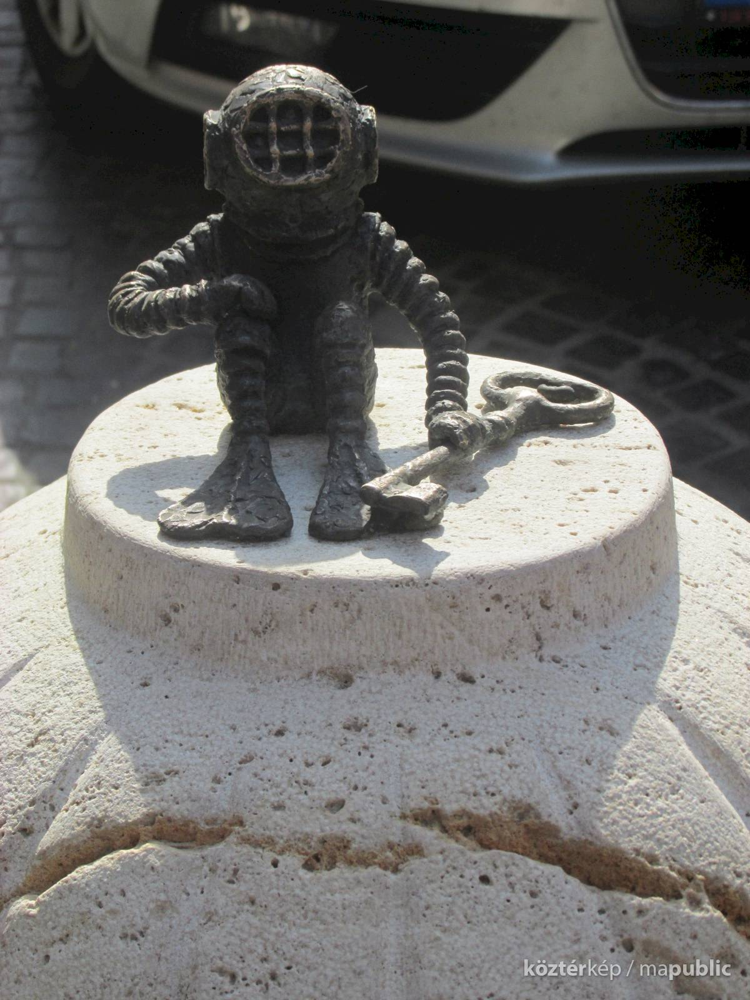

# Kolodko Mihály és a világnak szánt miniművészetei

- ukránul: Михайло Іванович Колодко
- latin betűkkel: Mihajlo Ivanovics Kolodko,
- említik még: Mihail Kolodko, Mykhailo Kolodko neveken is.

>Ungvár, Ukrán SZSZK, 1978 –) ukrán-magyar szobrászművész.

#### Élete és Tanulmánya
Kolodko **1978-ban** Ungváron született, anyai ágon magyar származású.

- **1996-ban** az Ungvári Erdélyi Béla Művészeti Szakközépiskolába végzet,

>Művészi irányú érdeklődése a középiskola elvégzése után.

- Majd **2002-ben** diplomát szerzett a Lvivi Művészeti Akadémiaban a monumentalitás szobrász szakán.

Alapvetően a **monumentális szobrászat** érdekelte, de ez a műfaj inkább a korai évekre, a Szovjetunió időszakára volt jellemző.

>Ahol a nagy, csodálatot kiváltó alkotásokat kedvelték.

De sok érdekes téma foglakoztatta. Eleinte **köztéri szobrokat** készített, mivel tanulmányait a plein air művészet terén gyakorolta, egyéni és csoportos munkákban is.
Úgy döntött hogy **2010-ben** neki lát a miniatűr város formátumát használni és ezekből [Magyarországon](https://www.kozterkep.hu/terkep?oldalcim=Kolodko+Mihály&visszalepes=%2Falkotok%2Fmegtekintes%2F6186%2Fkolodko-mihaly&alkoto_az=6186&alkoto=Kolodko+Mihály#lat=47.5398144&lon=19.1332352&zoom=19&layer=wikimedia.osm) található belőle (és Europa néhány részén).
Legtöbb szobra Ungváron található, de miután **2017-ben** áttelepült Magyarországra, itt is megjelentek alkotásai.

>Nálunk főleg miniszobrairól híresült el.

#### Művészete
Kolodko véleménye szerint azok az idők már elmúltak, hogy egy szobor elkészítését központilag határozzák meg; teret kell engedni a művészek és az emberek érdeklődésének is.
Így született meg például a **2010-ben** Ungváron felállított [Lámpagyújtogató szobor](https://www.kozterkep.hu/23830/lampagyujto) is, amely a város szülöttének, Kolja bácsinak alakját örökítette meg.
A köztéri szobrok egy más dimenziója született meg azáltal, hogy rátalált a mostanában olyan sok embert érdeklő **miniszobrok** témájára, melyek szerinte:

Ugyanolyan drámai erővel tudnak hatni a szemlélődőkre, mint az óriási alkotások.

Első apró alkotásai **Ungvár utcáin** jelentek meg, és eleinte vegyes fogadtatásra találtak; később, mikor már megszokottá váltak, az emberek **megkedvelték** őket.
A kis méretű szobrok elkészítése onnan eredt:

Hogy a nagy méretben készülő szobrokat is először kis méretben kell elkészíteni.

A művésznek nem mindig volt tervei megvalósításához **megrendelője**, és így anyagi fedezet híján, hogy ötletei **ne vesszenek el**, elkészítette őket **kicsiben**.
Kolodko, amikor Budapestre költözött a családjával, először is a

- [Főkukac szobrát](https://www.kozterkep.hu/30235/fokukac-miniszobra) készítette el, ungvári elődje mintájára.

A 15 cm-es szobrocska a **Bem rakpart 15. számú ház előtt helyezkedik el a felső rakpart mellvédjén**. Kolodko **kedvenc gyermekkori** mesefigurája kelt életre a kis szoborban: azt szerette volna, ha gyermekei is úgy tekintenek rá, mint ő gyermekkorában.

​
>Számára azért is volt fontos ez a mesesorozat, mert nézése közben tanulta meg a **magyar nyelvet**.

Az apró szobrok hamar népszerűséget szereztek maguknak, olyannyira, hogy némelyiket többször is ellopták ilyen például:

​

- a [Mekk Elek (az ezermester)](https://www.kozterkep.hu/34516/mekk-elek-az-ezermester) szobornak már a második példánya van kint a téren;
viccesen **Mekk Elek 2.0-nak** hívják a gerillaszoborként elhíresült alkotást. A gerillaszobrászat kifejezés onnan ered, hogy a szobrok engedély nélkül kerültek ki a közterekre, bár először nem is volt erre szabályzat.

Néhány művét ellátja saját szignójával is ilyen például:

- a [Roskovics Ignác szobor](https://www.kozterkep.hu/23241/roskovics-ignac), ahol az egész alakos szobor jobb kezében tartott ceruzán található meg a szignó vagy a részeges római legionárius sisaktaréján olvasható a neve.

## Források:

1. [Wikipedia](https://hu.wikipedia.org/wiki/Kolodko_Mihály)

2. [A Mű](https://amu.hvg.hu/2022/11/30/a-kozteri-giccs-otven-arnyalata-kolodko-mihaly-szobrairol/)

3. [Térkép](https://www.kozterkep.hu/terkep?oldalcim=Kolodko+Mihály&visszalepes=%2Falkotok%2Fmegtekintes%2F6186%2Fkolodko-mihaly&alkoto_az=6186&alkoto=Kolodko+Mihály#lat=47.5398144&lon=19.1332352&zoom=19&layer=wikimedia.osm)

4. [Kolodkoart](https://kolodkoart.com)

5. [Olyan jó](https://olyanjo.hu/cikk/kolodko-szobrok-terkep-az-osszes-hazai-kolodko-miniszobrok-terkepen/)

## Szobrok amiket lefotozzunk/lefotoztunk

#### 1. Drakula

#### 2. Sztálin Csizma

​

#### 3. Micimackó

​
#### 4. Garfield

#### 5. Noé Bárkája

​
#### 6. Szenes Hanna

#### 7. Tizenégy karátos autó

​
#### 8. Búvár és a kulcs

​
