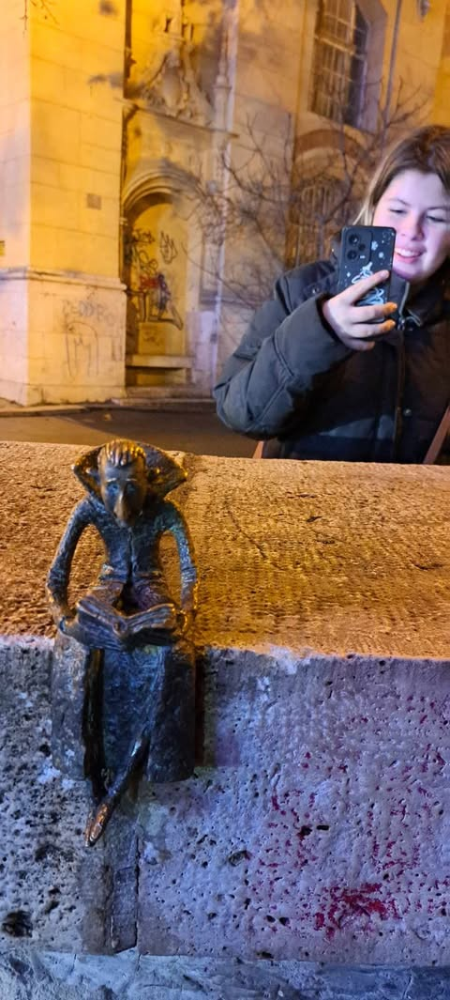
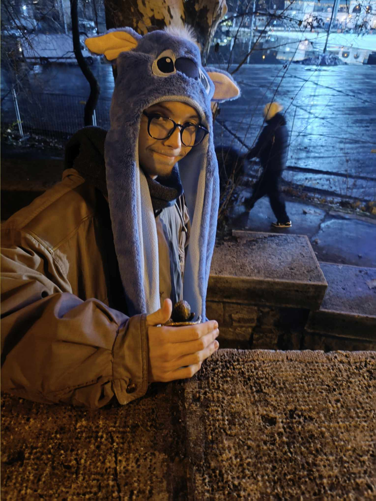
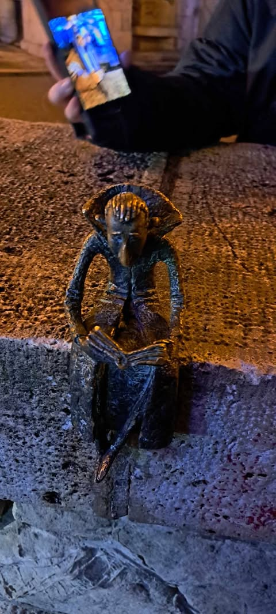
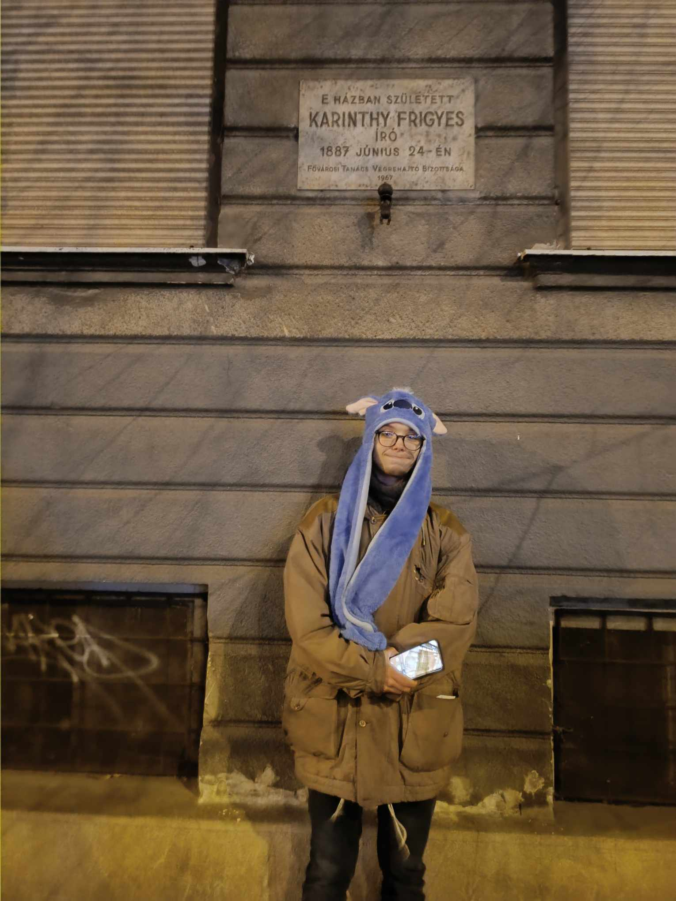
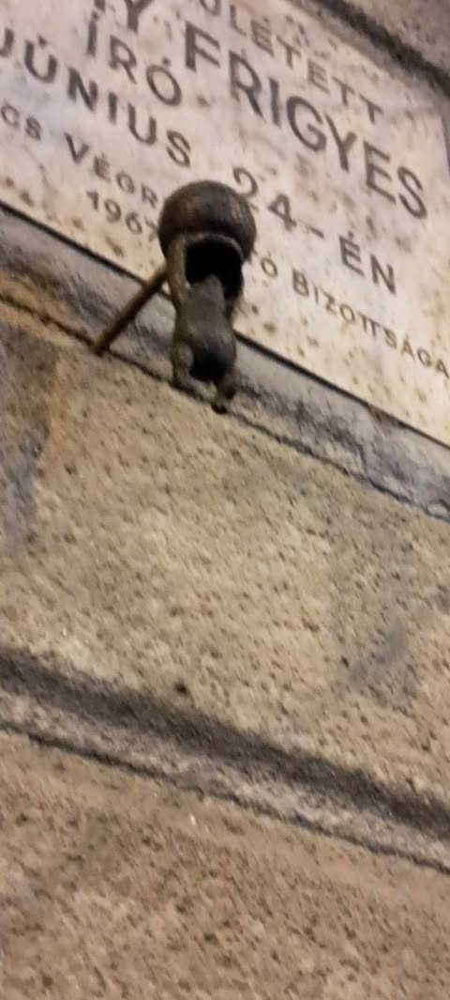
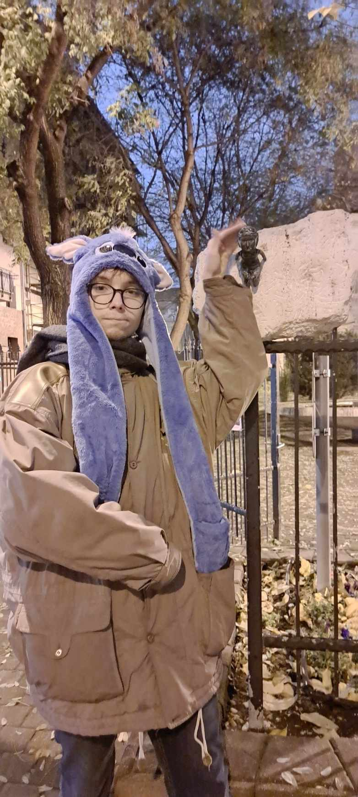
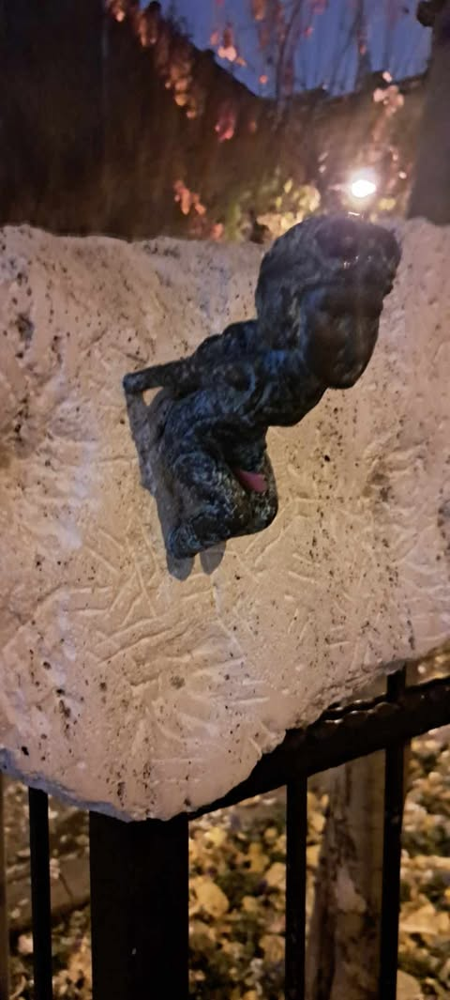
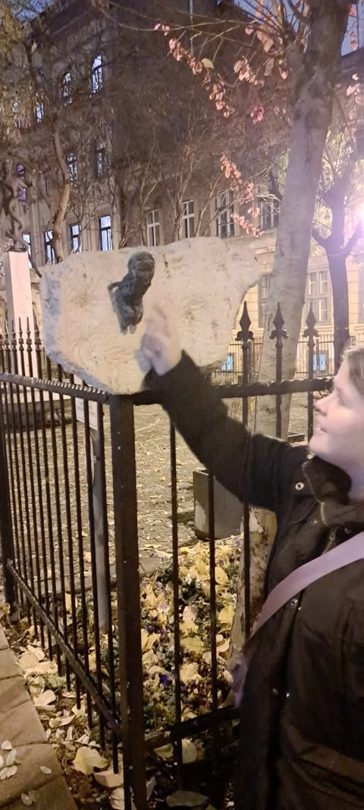

# Drakula 

Maga a művész még nem erősítette meg saját oldalain a **szobor létét**, igy pontos kihelyezési **időpontot** sem tudunk. 
Az elhelyezkedés és a megformálás alapján **Lugosi Bélát** ábrázolja, mint **Drakula**, aki **szorgosan** és **kissé búsan** olvassa könyvet.
Engem elvarázsolt, az egyik **legszívetmelengetőbb** szobor talán.

Kolodko Drakula szobránál sokat **morfondíroztunk**, vajon miért került a **Vajdahunyad várához**. Már a Kolodko szobor előtt is **vaciláltunk**, ugyanis van még egy Drakula mellszobor, ami 2003-ban került oda, egyébként nem messze **Kolodko Drakulájától**. A vacilálásunk oka az, hogy **Drakula gróf**, azaz az életben **Vlad Tepes** hírhedt havasalföldi vajda törcsvári. És nem **vajdahunyadi**. Mindkét város vára **Erdélyben** található, sőt, a világhírűvé vált **Drakula film** főszereplője, Drakula gróf is **erdélyi**, **Lugosi Bélának** hívták (egyike azon magyaroknak, akik csillagot kaptak a hollywoodi hírességek sétányán). Szóval ez jó, szuper, hogy van egy világhírű sztorink, világhírű színésszel.

Aztán azt is érdemes tudni, hogy a magyarországi **Vajdahunyad vára** bizony nem az **erdélyi Vajdahunyad Várának** a másolata. Hanem egy építészzseni, **Alpár Ignác** műve, aki a történelmi **Magyarország** legjelentősebb épületeinek formáit (pl. a **Hunyadi család** Vajdahunyadban található várának részlete, a **segesvári Apostol-torony** részlete, **a jáki** és **lébényi templom** részlete, **brassói Katalin bástya** részlete, stb.) ötvözte egybe, itt Budapesten, az 1896-os **Millenniumra**. De törcsvári vár részletet **Alpár Ignác** alkotásában nem találtunk. Viszont utána olvastunk az erdélyi Vajdahunyad Vára mai világának, ahol bizony (átírva az eredetiséget) behúzták maguk alá, magukhoz **Drakulát**, és **turistalátványosságként** megteremtették a Vajdahunyad Várának Drakula **mítoszát** a történelmi **Hunyadi család** valósága mellé. Szumma-szummárum, a sztori némileg torz. Lehet, hogy Kolodko Drakulája is azt próbálja kiolvasni a könyvéból, hogy hogy is van ez..?

>Érdekesség, hogy a Városligetben (ahol a **Vajdahunyad Vára** is található) volt még egy Kolodko szobor, a Piszoár nevű, amit sajnos már a helyszínen nem lehet megnézni.

# Micimackó

**1967-ben a Fővárosi Tanács** márvány emléktáblát helyezett a ***Damjanich utca 27. számú ház*** falára.
Ugyanis ebben a házban született **1887. június 24-én Karinthy Frigyes** magyar író, költő és műfordító.
Édesanyja **1895-ben** bekövetkezett haláláig itt élt a család, ezután az **édesapja** a **hat gyerekkel elköltözött** a házból.

S most az író **születésnapjának évfordulóján** Kolodkó Mihály legújabb **Micimackót** ábrázoló miniszobra került az emléktábla alá. Micimackó egy **mézescsuprot tart** a feje felett, hogy az utolsó csepp mézet is **kinyerhesse** belőle, mivel ez a kedvenc eledele.

**Milne** híres meseregénye, **Micimackó és barátainak története**, ***magyarul*** először **1935-ben jelent** meg **Karinthy** fordításában.
Mivel Karinthy nem beszélt angolul, a művet az író nővére, **Karinthy Emília** (Mici) készítette elő az író számára, irodalmi szerkesztésre.[1]
Nővére iránti tiszteletből, nővére beceneve után kapta a kis mackó a **Micimackó** elnevezést.

# Noé Bárkája

Sokan a **kárpátaljai származású** művész egyik legjobb munkájának tartják **szimbolikus jelentése** és **csodálatos kidolgozottsága** miatt. Állatokat nem találni a **szobor belsejében**, a jelenlétüket az elhelyezkedés érzékelteti. A bárka ablakain bekukkantva apró, színes üvegablakok emlékeznek meg a **bibliai szivárványról.**

## Háttérsztori
A szerény méretekkel bíró alkotás a **bibliai özönvíz** történetét dolgozza fel, melyet az **Ószövetség** első könyvében jegyeztek le. A tanítás szerint **Isten** megelégelte az emberek gonoszságát és úgy döntött, hogy **40 napon** és **40 éjjelen** át tartó esőt zúdít a világra.

Egyedül az istenfélő **Noé és családja** menekült meg a pusztító áradattól, akit azzal bíztak meg, hogy építsen egy hatalmas bárkát a **Föld** állatfajainak megóvására. Az **özönvíz** végét azzal jelezte a **Mindenható**, hogy szivárványt vont az ég kékjére, ami azóta is a **remény** és az **újrakezdés jelképe**.

# Szenes Hanna

Végre egy valós nőnap! A Hosszúlépés. Járunk? csapata, akik alapban tematikus sétákat szerveznek, mozgalmat indított **Wonder Women** címen. Megelégelték, hogy Budapesten irreálisan nagyobb számú szobor van, ami akár inkább állatokat ábrázol, míg a számolt **1200-ból** mindössze **35 ábrázol nőt**, aki "nem **meztelen dekorációs** elem, hanem akár **hős** vagy **példakép**."[2] Az elmúlt évben, nőnap alkalmából, kartonszobrokat állítottak a hiányzó **női szobrok** jelölésére. Idén azonban a megvalósítás jegyében szobrot állíttattak Erzsébetvárosban... az elsőt, a tervezettek közül. Tőlük:
"Tavaly megfogadtuk - most megvalósítottuk!
Ma kikerült a városba az első hősnő, **Szenes Hanna miniszobra**, melyet Kolodko Mihály a Hosszúlépés támogatásával alkotott!" [1]
A mozgalommal, a kezdeményezéssel kapcsolatban a továbbiakban ajánlom a forrás cikkét [2] + az egyéb kapcsolódó weblapoknál a "misszió" bemutatását honlapjukon.

Nem véletlen a hely, nem véletlen a háttér.
**Szenes (Anikó) Hanna költő**, ejtőernyős, **háborús hős** volt.
Az asszimilált **zsidó családban** született Anikó **emigrálni** kényszerült, mivel a zsidótörvények miatt nem vették volna fel az egyetemre. Az akkor brit fennhatóság alá tartozó Palesztinába menekült. **1943-ban** csatlakozott a brit hadsereghez. '44-ben **Magyarországra küldték**, feladata a **magyar zsidók deportálásának** megakadályozása volt. A határon elfogták, többszörösen **megkínozták**, édesanyjával **zsarolták**, **árulásra akarták kényszeríteni**, de **nem adta meg magát**. Árulással **vádolták**, **1944 őszén** a Margit körúti **fogházban** kivégezték. **Izraelben** nemzeti hősként tisztelik, míg itthon eddig mindössze az a park őrizte emlékét, aminek sarkán a **miniszobrot** most elhelyezték.
**Szenes Hannát ejtőernyős** öltözékben, abban a pozícióban ábrázolta Kolodko Mihály, ahogy a székhez kötözve kínozták... vagy éppen ugrik (?). Háta mögött Magyarország mészkőből faragott sziluettje látszik. Fejét felemelve, nyílt tekintettel néz szembe a nézővel.

